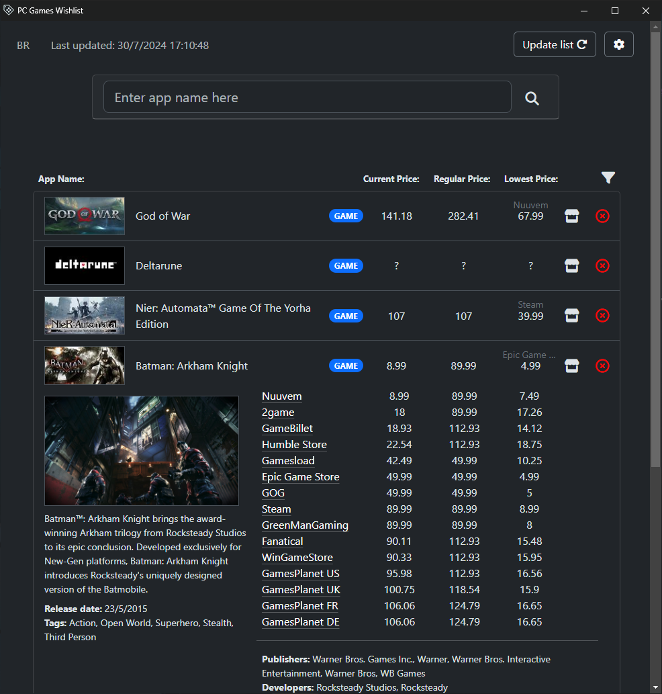

# PC Games Wishlist 

PC Games Wishlist is a simple program done with Eel for making a game wishlist that incorporates multiple stores. It's an application that makes it more easy to find the best deal.

This program uses the **Is There Any Deal API** and the **Steam API** to get game information and their price depending on the store. 

## Usage

The executable is inside the folder **dist**. You will need to keep the executable inside the same folder as **_internal** for the program to work.

When starting, to add a game, enter the games' name on the input box, you can either click on :mag_right:, to search for the respective game or others with similar titles, then add it to the list, or you can more easily add it by pressing enter.

The game will appear in your list with mutiple store options, showing their current, regular and lowest price.

After adding games to your list, you can order it or use multiple filtering options (*stores, tags, developers, publishers, ...*)

> [!IMPORTANT]
> **The program's country is set to 'US' by default.** To change that, you need to click on :gear:, then change it to your country.

> [!NOTE]
> This is a really simple application, done to test my Python and Web skills.

